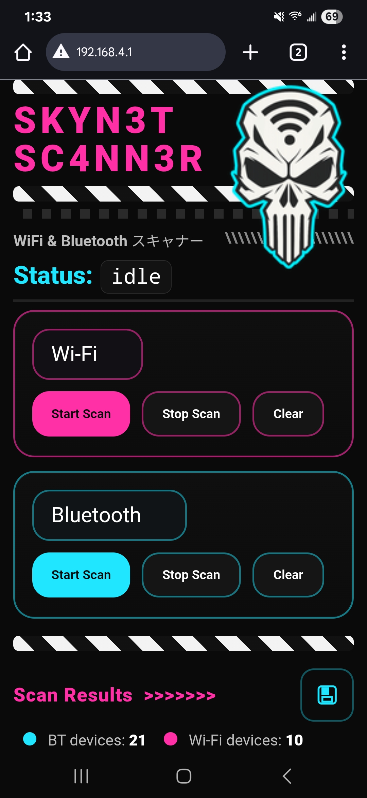

# ☠️ Skyn3t Sc4nn3r

<p align="center">
  
</p>

<p align="center">
  -= SKYN3T SC4NN3R is designed for the Lilygo S3 Display (without screen but likely works with screen, but no code for it included.. =-
</p>

<p align="center">
  -=[ Created by: · <a href="https://github.com/out0fstep">out0fstep</a> ]=-
</p>

<p align="center">
  [](https://opensource.org/licenses/MIT)
  [](https://github.com/out0fstep/Hack3r-T-Deck/releases)
  [](https://buymeacoffee.com/out0fstep)
  [](https://x.com/DorkfeastTeam)
</p>

---

## 📡 Overview
**Skyn3t Sc4nn3r** is an experimental Wi-Fi and Bluetooth scanning tool built for ESP32-S3 devices (LilyGO T-Deck and similar).  
It pairs a distinctive cyber-punk UI with practical scanning features and a headless mode that serves a command page over a private AP (useful if the device display is cracked).

<p align="center">
  
</p>

---

## ✨ Features
- 🔎 **Wi-Fi scanning** with channel and RSSI info  
- 🔍 **Bluetooth scanning** for nearby devices  
- 🎨 **Custom UI** with animated banners and themed visuals  
- ⚡ Lightweight and optimized for ESP32-S3  
- 🎛️ On-device controls and headless mode with a web UI

---

## 🛠️ Hardware
- ESP32-S3 Dev Board / LilyGO T-Deck (or compatible)  
- OLED / TFT display (optional if running headless)  
- Optional external antennas for improved range

---

## 🚀 Getting Started

### 1. Clone the repository
```bash
git clone https://github.com/yourusername/skyn3t-sc4nn3r.git
cd skyn3t-sc4nn3r
